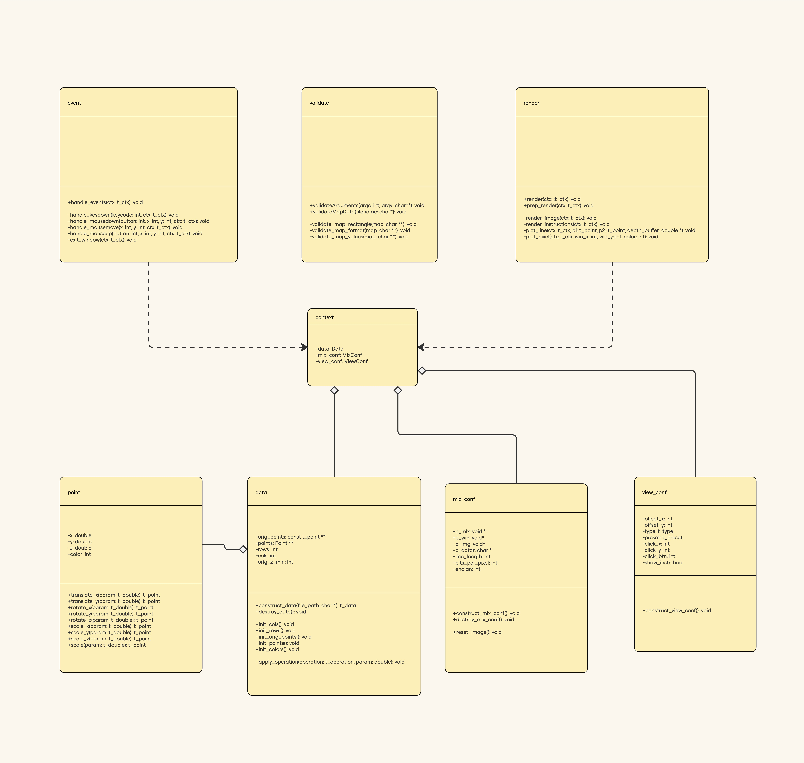
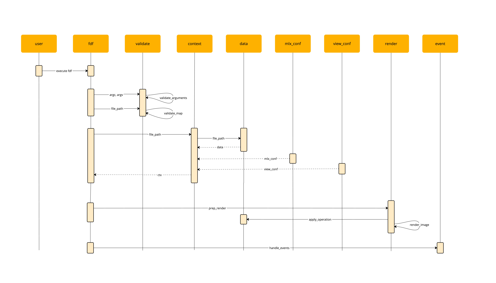
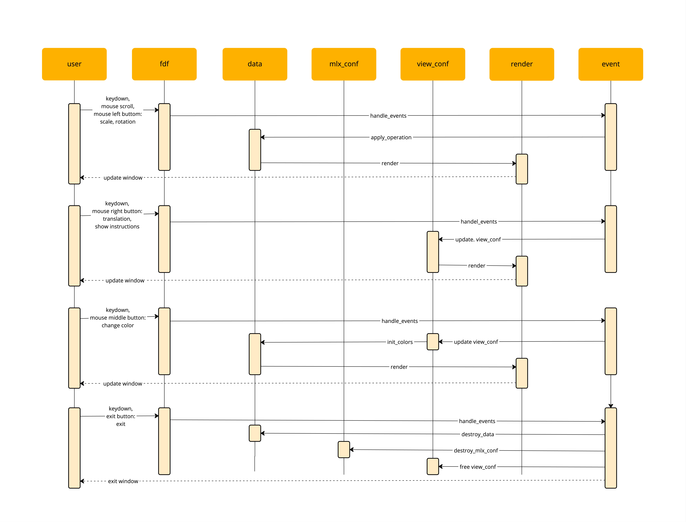

# FDF

## Installation

To install the project, use the following command:

```sh
git clone https://github.com/rask24/fdf --recursive
```

## Building

To build the project, navigate to the project directory and run:

```sh
make
```

## Usage

To run the application, use:

```sh
./fdf ./maps/42.fdf
```

### Controls

The application supports various keyboard and mouse inputs to manipulate the view and interact with the map:

#### Keyboard Controls

- 1: Switch to isometric view
- 2: Switch to top view
- 3: Switch to oblique view
- W: Move the view up
- A: Move the view left
- S: Move the view down
- D: Move the view right
- F: Zoom in
- G: Zoom out
- Q: Rotate left around the Y-axis
- E: Rotate right around the Y-axis
- R: Rotate up around the X-axis
- V: Rotate down around the X-axis
- Z: Rotate counterclockwise around the Z-axis
- C: Rotate clockwise around the Z-axis
- X: Cycle through color presets
- T: Toggle instructions
- ESC: Exit the application

#### Mouse Controls

- Left Button: Rotate the view
- Right Button: Move the view
- Middle Button: Cycle through color presets
- Scroll Up: Zoom in
- Scroll Down: Zoom out

## FDF File Format

- Each line consists of multiple elements separated by spaces or tabs (trailing spaces or tabs are also accepted).
- Each element represents the **height** and must be an integer within the range of `INT_MIN` to `INT_MAX`.
- An element can optionally include a **color** in hexadecimal format starting with `0x`, within the range of `0x000000` to `0xFFFFFF`.
- The number of elements in each line remains consistent, forming a well-defined rectangular shape.
  - A single element in a map (e.g., 0) is considered invalid and will result in an error.
  - A map that forms a straight line (e.g., 0 0 or 0\n0) is considered a valid rectangle if it consists of at least two elements in total, either in a single row or across multiple rows.
  - An empty map or a map with only delimiters or invalid characters is considered invalid and will result in an error.
- A newline character, space, or tab at the end of the file is optional.

### Sample Format

```plaintext
0  0  0  0  0  0  0  0  0  0
0 10 10 10 10 10 10 10 10  0
0 10 20,0xFF0000 15,0xFF0000 12 15,0xFF0000 17,0xFF0000 20,0xFF0000 10  0
0 10 15,0xFF0000 10 12 15,0xFF0000 15,0xFF0000 15,0xFF0000 10  0
0  5 15,0xFF0000 10 12 15,0xFF0000 15,0xFF0000 13 10  0
0  5 10  5  7 12 12 12 10  0
0  5  7  1  2  7  5  5  7  0
0  3  0  0  1  2  2  2  5  0
0  1  0  0  0  0  0  0  3  0
0  0  0  0  0  0  0  0  0  0
```

## Design Diagrams

### Class Diagram



### Sequence Diagrams

#### normal



#### handle events


